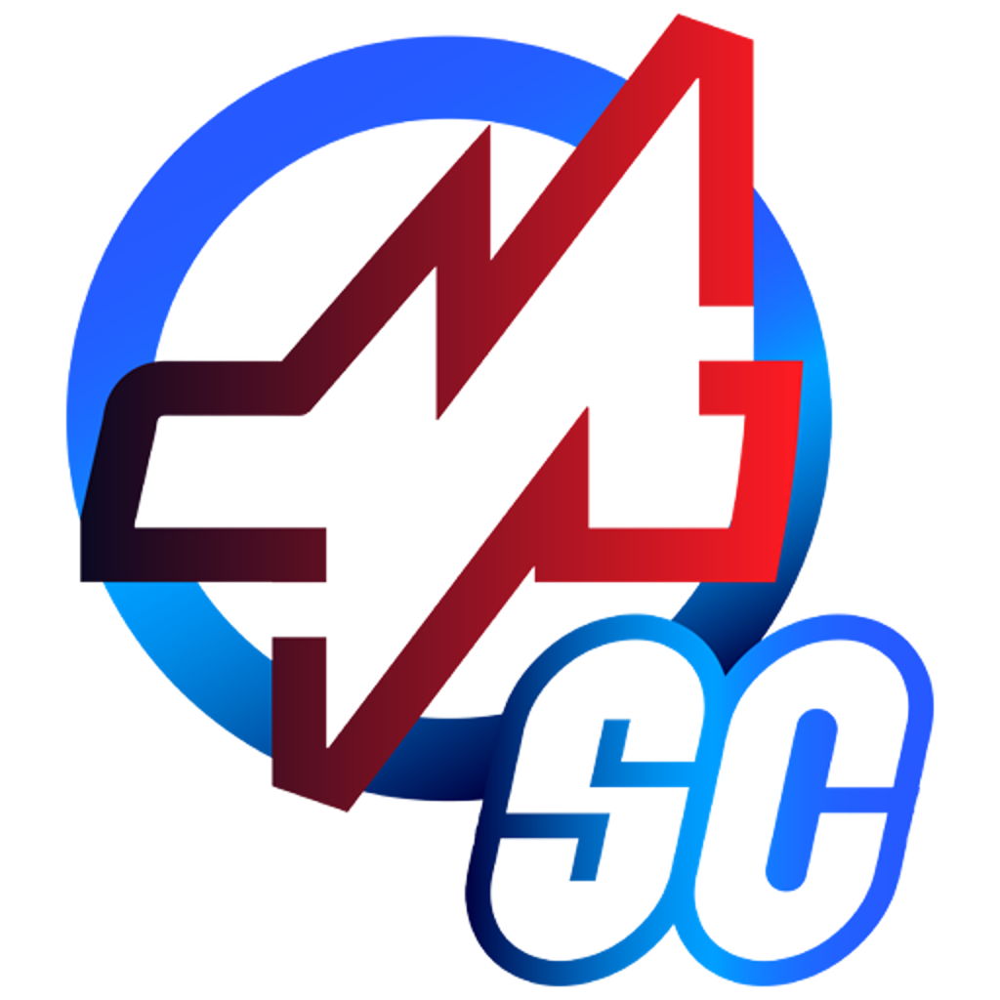
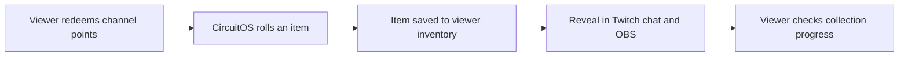
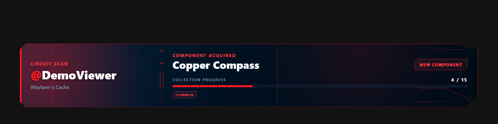

# CircuitOS

**Turn Twitch channel points into a collection game for your community.**

Viewers redeem a reward, discover an item in chat and on your stream, and build a persistent inventory. Create the collections, rarities, variants, and look of the game from a Windows desktop app.

**[Download for Windows](https://github.com/shortcircuit819-arch/CircuitOS/releases/latest)** · **[itch.io](https://shortcircuit819.itch.io/circuitos)** · **[Setup guide](docs/installation-and-updates.md)**

Current application version: **1.0.4** · Windows x64 · Free under the [MIT License](LICENSE)

## How it works

Circuit Components, an electronics-themed collection, is included to get you started. Replace it with a theme that fits your channel.

## See it in action

[Watch the short demo and browse screenshots](docs/demo-kit.md) · [Try three free collection packs](examples/collections/README.md)

## Make it your game

- **Build a catalog:** collections, weighted rarity tiers, shiny or foil variants, seasonal items, and featured collection boosts.
- **Give viewers progress:** inventories, collection completion, leaderboards, and chat commands for missing items and duplicates.
- **Put duplicates to use:** a configurable salvage economy and economy analytics.
- **Match your stream:** editable terminology, messages, colors, themes, and an OBS reveal overlay.
- **Run multiple games:** independent profiles with their own inventories and settings; share games as `.circuitmodule` bundles or collections as `.circuitcollection` packs.
- **Manage and recover:** import catalogs from CSV, simulate pulls, inspect viewer inventories, and use validation, backups, and recovery tools.

## Start streaming

1. Download **`CircuitOS-win-Setup.exe`** from the [latest release](https://github.com/shortcircuit819-arch/CircuitOS/releases/latest) and install it.
2. Complete the setup wizard and customize your collection.
3. Connect Twitch and configure the channel-point reward. Native integration handles redemptions and chat; no scripts or developer account are needed.
4. Add the overlay to OBS using **Overlay Editor → OBS Setup**. See the [OBS guide](docs/obs-lower-quarter.md).

You need **Windows x64** and a Twitch channel with **channel-point rewards available** for live redemptions. OBS displays the optional stream overlay. The .NET runtime is bundled; the app uses Microsoft Edge WebView2. CircuitOS is an independent project, not an official Twitch or OBS product.

Current installers are **unsigned**. Windows may show an unknown-publisher warning. The [installation guide](docs/installation-and-updates.md) explains verification and setup; release notes include SHA-256 checksums.

## Updates and your data

Installed copies check for updates from **Settings → About**. The normal installed data folder is separate from application files; use **Open data folder** to find the location your copy uses. Keep backups before updating or moving an installation.

Local storage is the default. Optional cloud storage requires your own Appwrite configuration; hosted cloud service is not included. See the [installation and recovery guide](docs/installation-and-updates.md).

## Help and feedback

- [Report a bug](https://github.com/shortcircuit819-arch/CircuitOS/issues/new?template=bug_report.yml) or [suggest a feature](https://github.com/shortcircuit819-arch/CircuitOS/issues/new?template=feature_request.yml).
- [Installation and updates](docs/installation-and-updates.md) · [OBS setup](docs/obs-lower-quarter.md) · [Configuration editor](docs/configuration-editor.md)
- [Collection imports](docs/collection-importer.md) · [Collection packs](docs/collection-packs.md) · [Salvage](docs/salvage.md)
- [Latest patch notes](docs/patch-notes/v1.0.4.md) · [Release history](docs/release-history.md)

Include your app version, install type, reproduction steps, and a redacted diagnostics report if useful. Do not post tokens, cloud credentials, or private viewer data.

## What's next

The 1.x direction includes hosted cloud, deeper streamer analytics, achievements, online viewer profiles, a Twitch extension, module discovery, and trading. These are planned areas, not available features or promised release dates. The proposed 2.0 direction is a Shop and Currency Workshop.

## Privacy

CircuitOS has no telemetry and does not send application data to the developer. Twitch connections operate after login; OAuth tokens are stored encrypted locally. Optional Appwrite storage sends data to the backend you configure. Update checks contact GitHub Releases. Catalogs, inventories, and settings otherwise remain on your machine by default.

## Contributing

See [CONTRIBUTING.md](CONTRIBUTING.md) for source layout, checks, and contribution guidance, and [versioning](docs/versioning.md) for release policy. Development uses AI coding assistance.
