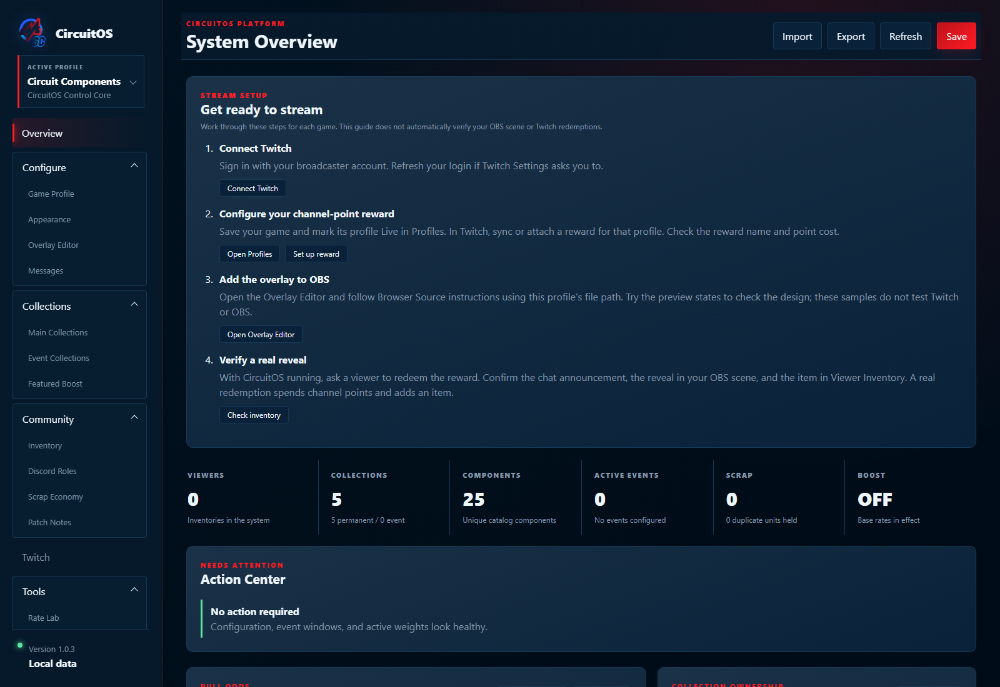
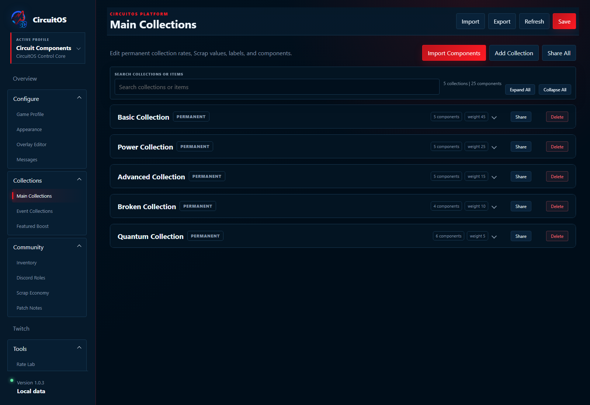
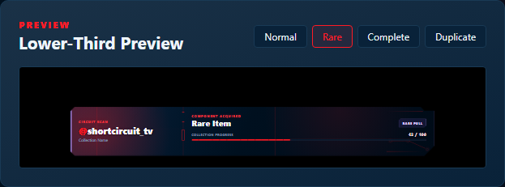

# CircuitOS demo kit

Free assets for showing CircuitOS to your community. Screenshots use the real 1.0.3 app with disposable local data. The short silent video renders sample reveal data through the real overlay; it is a demonstration, not footage of a live Twitch redemption.

## Watch the reveal

[Download or play the 12-second WebM demo](media/overlay-preview.webm).

## Set up your stream

## Customize your game

## Try a sample collection

[Download the three collection packs and read import instructions](../examples/collections/README.md): Wayfarer's Cache, Cloudberry Cafe, and Quiet Orbit Discoveries. They contain original text content and no viewer inventories. Importing creates a separate profile; configure its reward before using it live.

The application screenshot paths are examples from disposable data. Always copy your own OBS path from CircuitOS. Assets and packs are distributed under the repository's MIT license.
